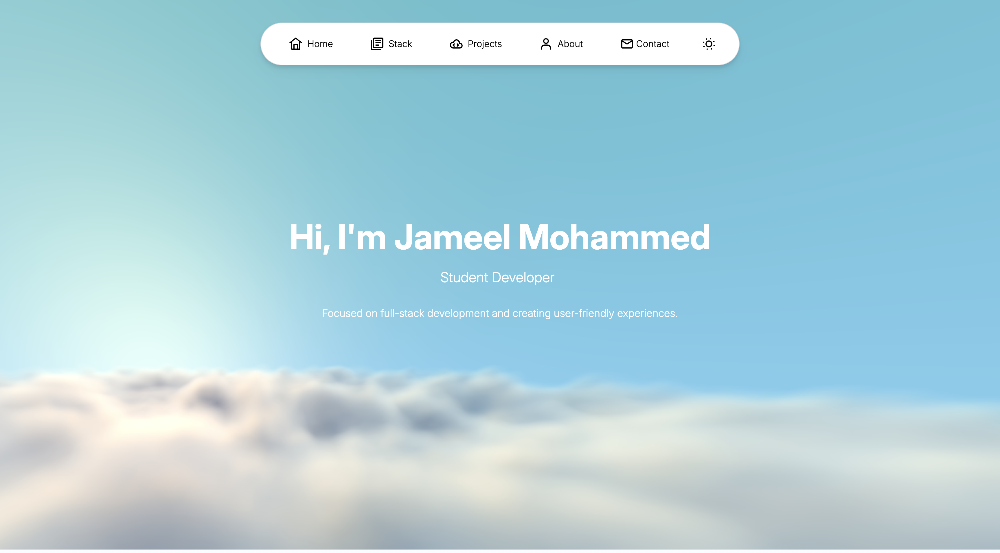

# Portfolio Website

A modern, responsive portfolio website featuring an interactive cloud background, dark mode support, and smooth animations.



## Description

This is my personal portfolio website showcasing my projects and technical skills. The site features a clean, modern design with interactive elements including a typewriter effect, animated SVG icons, and a dynamic Vanta.js cloud background that adapts to light and dark modes.

Key features include:
- **Responsive Design**: Fully responsive layout that works seamlessly across desktop, tablet, and mobile devices
- **Dark Mode**: Toggle between light and dark themes with persistent storage
- **Interactive Background**: Vanta.js cloud animation that changes based on the selected theme
- **Typewriter Effect**: Dynamic hero text that cycles through multiple phrases
- **Smooth Animations**: Animated SVG icons and smooth scrolling navigation
- **Mobile Navigation**: Burger menu for mobile devices with smooth transitions

## Project Structure

```
portfolio/
├── index.html          # Main HTML file with all sections
├── portfolio.js        # JavaScript for interactions and animations
├── icons.js           # SVG icon library with animated icons
├── README.md          # Project documentation
└── images/            # Image assets
    ├── binge.jpg
    ├── binge_invis.png
    ├── CLashroom.png
    ├── BOTRS img.png
    └── IMG_9255.jpeg
```

### File Breakdown

- **index.html**: Contains the complete portfolio structure including:
  - Navigation bar (desktop and mobile)
  - Hero section with Vanta.js background
  - Tech Stack section
  - Projects section
  - About Me section
  - Contact section

  > **Note**: An Experience section is not currently included as I do not yet have relevant technical work experience. This section will be added once I gain professional experience in the field.

- **portfolio.js**: Handles all interactive functionality:
  - Icon population from the icon library
  - Typewriter effect for hero text
  - Dark mode toggle with localStorage persistence
  - Vanta.js background initialization and theme switching
  - Smooth scrolling navigation
  - Mobile menu interactions

- **icons.js**: Centralized SVG icon library with animated icons for:
  - Navigation (home, stack, projects, about, contact)
  - Social media (GitHub, LinkedIn)
  - UI elements (sun/moon for theme toggle, burger menu, email)

## Vanta.js Background

The portfolio uses [Vanta.js](https://www.vantajs.com/) CLOUDS effect to create an interactive, animated background in the hero section. The implementation features:

- **Theme-Adaptive Colors**: Different color schemes for light and dark modes
  - **Light Mode**: Bright blue sky (`#68b8d7`) with soft white clouds
  - **Dark Mode**: Deep blue sky (`#1a1a2e`) with dark clouds and purple sun tones

- **Dynamic Initialization**: The background is destroyed and recreated when switching themes to ensure proper color transitions

## Technologies Used

- **HTML5**: Semantic markup and structure
- **CSS3**: Custom styling with Tailwind CSS utilities
- **JavaScript**: Modern JavaScript for interactions
- **Tailwind CSS**: Utility-first CSS framework via CDN
- **Vanta.js**: 3D background animations
- **Three.js**: WebGL library (required by Vanta.js)
- **Google Fonts**: Inter font family

## Tools Used

- **VSCode**: Primary code editor
- **Claude Code**: AI-powered development assistant used for debugging
- **Git**: Version control
- **GitHub**: Repository hosting and collaboration

## Contact

- **Email**: jmohammed14@my.bcit.ca
- **LinkedIn**: [Jameel Mohammed](https://www.linkedin.com/in/jameelm01/)
- **GitHub**: [@jameeel01](https://github.com/jameeel01)
